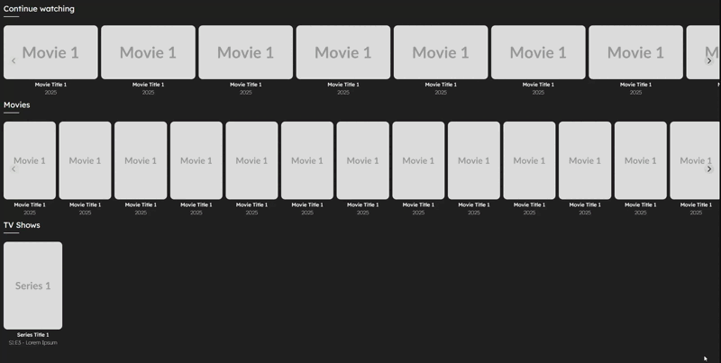
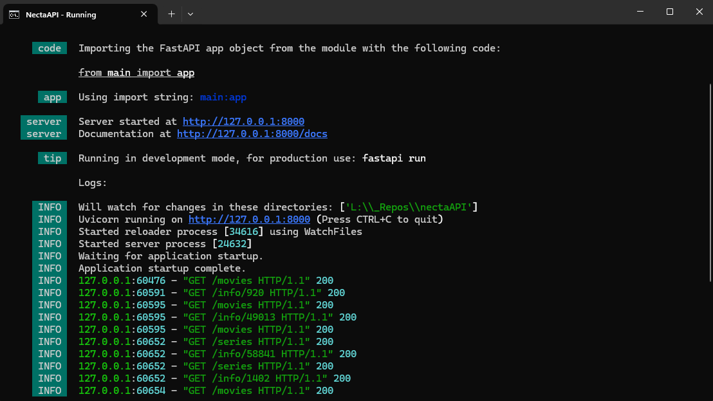
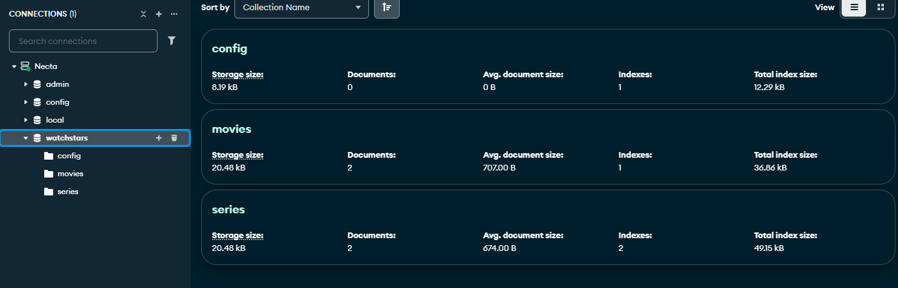
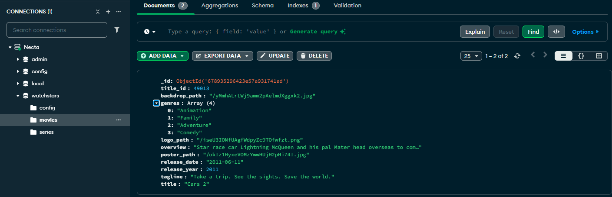
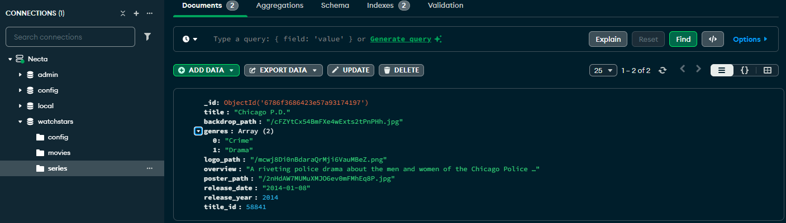
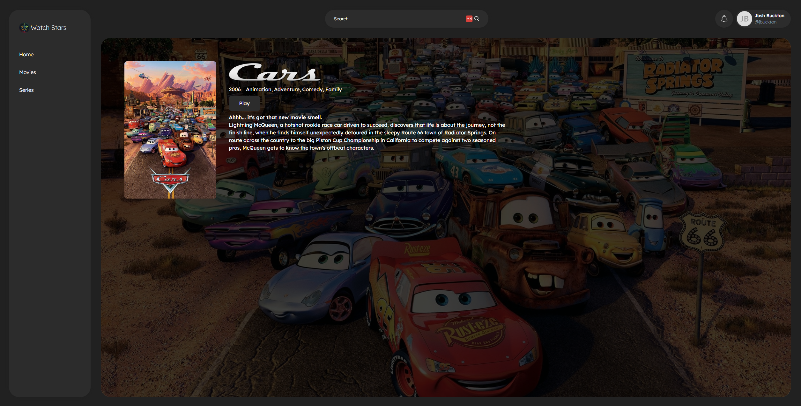
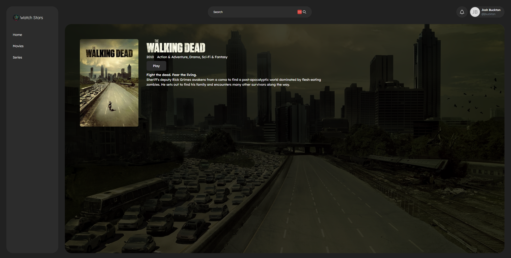

# Watchstars [WIP]

Watchstars is a personal side project designed to serve as my own customizable media server for movies and series.

I got tired of storing DVDs around the house and struggling to find them when needed, so I decided to rip all my DVDs and store them digitally on a server. While there are many media servers available, I found them lacking in customization. That’s why I set out to build my own.

Not only does this allow me to create a media server that looks and functions exactly how I want, but it has also been a great learning experience. I’ve explored API development, integrating with [TheMovieDB](https://TheMoviedb.org), storing data in MongoDB, and using this information to display relevant content, such as:
- Movie/Series titles
- Release year
- Summaries
- Genres
- And more!

Since this is a **Work in Progress**, the design and functionality may change over time.\
And as this is a personal project, I may not release a public version. But you are more than welcome to make your own API to work with this.

## Features

### User Interface

The website features a carousel-based design using Splide.js to showcase movies and series.

Currently, the carousels are placeholders while I develop full functionality.

### Backend & API Integration

The movie/series information displayed comes from:
- [TheMovieDB](https://TheMoviedb.org)
- My custom API (**NectaAPI**)
- My MongoDB database

#### NectaAPI

#### MongoDB Collection

### How It Works
1. The system fetches movie/series details by calling `/fetch-movie` or `/fetch-series` with the title as a parameter.
2. If the requested information is not already in MongoDB, the API retrieves it from TheMovieDB and saves it locally.
3. Future requests check MongoDB first, reducing unnecessary API calls and improving performance.

#### Example Database Collections

**Movies Collection:**  

**Series Collection:**  

### Movie/Series Item Page

Each movie or series has a dedicated page displaying key details. Future improvements will include:
- **Actor information** for each movie/series
- **Personalized recommendations** based on genres
- And much more!

#### Movie Item page Example:

#### Series Item page Example:

## Future Plans
There are many features I want to add to this web app, but due to work and a busy home life, progress has been gradual. However, I am committed to refining and expanding this project over time.

---

This project was generated with [Angular CLI](https://github.com/angular/angular-cli) version 18.2.0.
